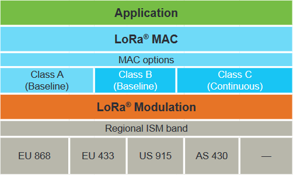
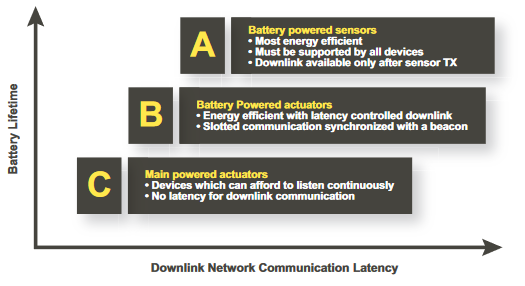
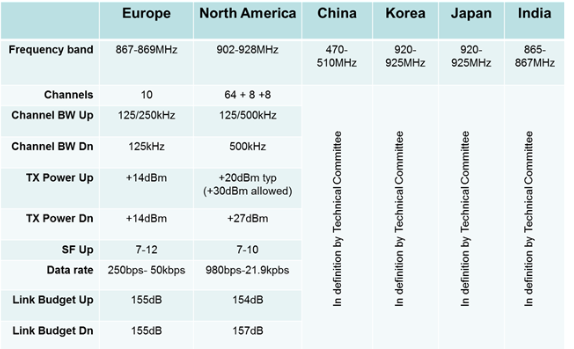

# LoRa and LoRaWAN

### (1) What is LoRa ?

- LoRa is a technology providing the wireless modulation/physical layer used to create a long range communication link. It is based on chirp-spread spectrum modulation.

- LoRa gateways or base station can cover large zones (i.e. hundreds of square kilometers) depending on obstructions. LoRa and LoRaWAN's have a very large link budget, which determines the range in a specific environment.
- LoRa is considered to be a LPWAN (i.e. Low Power Wide Area) technology, which fits the needs of IoT devices. Compared to other Local Area Network standards (i.e. WiFi and Bluetooth) and Cellular Networks standards (i.e. GSM, 3G, 4G...),it has a very restricted data rate and is still an emerging standard, however it offers low power consumption, a low cost, and less restrictions when it comes to positioning.
- LoRa wireless modulation respects regional standards, and can be set-up to operate in the appropriate ISM bands (EU 868, EU 433, US 915, AS 430...). Lebanese laws allow us to operate in the EU868 and EU 433 bands. For more information on identifying the appropriate channels per country, please see [this document](https://link.springer.com/content/pdf/bbm%3A978-1-4842-4357-2%2F1.pdf). 

### (2) What is LoRaWAN ?

- As mentionned, LoRa defines the wireless modulation used, and enables long-range communication links. The LoRaWAN standard is built on top of LoRa, and defines the communication protocol and system architecture of the network.

- *LoRaWAN* Network Architecture
  - A star network architecture can be adopted to have the least complex LoRaWAN network. It's better to aim for simplicity in a LoRaWAN network, because the more complexity we add to our network, the less battery lifetime and network capacity we should expect.
  - LoRaWAN network nodes are not associated with a specific gateway, instead we should expect each node to transmit to all gateways in proximity. Each gateway will forward the received packet to the cloud based network server, which will filter redundant packet and schedule acknowledgments for received packets.

- *LoRaWAN* Battery Lifetime
  
  - LoRaWAN nodes follow the Aloha protocol. It means that each nodes are asynchronous and communicate when they have data ready to sent, which can be either event-driven or scheduled. Not needing each node to "wake-up" to synchronize with the network and check for messages (like in mobile networks for example), allows us to be more battery-efficient, as these synchronization events have shown to be the biggest culprit in battery consumption.
- *LoRaWAN* Network Capacity
  
  - LoRaWAN allows for high network capacity by utilizing adaptive data rate and multichannel multi-mode transceiver in the gateway so that simultaneous messages on multiple channels can be received ( PS : EU686 allows for 10 channels, US915 allows for 64 channels). A network can be deployed with a minimal amount of infrastructure, and as capacity is needed, more gateways can be added, shifting up the data rates, reducing the amount of overhearing to other gateways, and scaling the capacity by 6-8x.
- *LoRaWAN* Security
  
  - LoRaWAN uses two layers of security : one for the network and one for the application.
  - The network security ensures authenticity of the node in the network while the application layer of security ensures the network operator does not have access to the end user's application data. AES encryption is used with the key exchange utilizing an IEEE EUI64 identifier.
- *LoRaWAN* Device Classes
  
  - LoRaWAN uses different device classes to serve different types of end-devices, each with trade-offs related to battery lifetime and downlink communication latency.
  
    
  
  - More details about Class A (from LoRa-Alliance documentation)
  
    - "End-devices of Class A allow for bi-directional communications whereby each end-device’s uplink transmission is followed by two short downlink receive windows. The transmission slot scheduled by the end-device is based on its own communication needs with a small variation based on a random time basis (ALOHA-type of protocol). This Class A operation is the lowest power end-device system for applications that only require downlink communication from the server shortly after the end-device has sent an uplink transmission. Downlink communications from the server at any other time will have to wait until the next scheduled uplink."
  
  - More details about Class B (from LoRa-Alliance documentation)
  
    - "Class B devices open extra receive windows at scheduled times in addition to the Class A random receive windows. In order for the end-device to open its receive window at the scheduled time, it receives a time-synchronized beacon from the gateway. This allows the server to know when the end-device is listening."
  
  - More details about Class C (from LoRa-Alliance documentation)
  
    - End-devices of Class C have almost continuously open receive windows, only closed when transmitting. 
  
  

- *LoRaWAN* Regional Summary

- *LoRaWAN* Summary

# Source

- [LoRa-Alliance Official Documentation](https://lora-alliance.org/sites/default/files/2018-04/what-is-lorawan.pdf)

