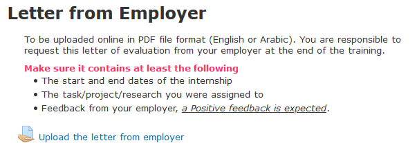

# Meeting #11 - August 19th

### Work Completed during this Week

- Selecting PCB components to order
   - List of components is available [here](https://hsandid.github.io/SmartIrrigationSystem/docs/Incomplete-Documentation/Components-to-Order/)

- Final Deliverable for the Internship
  - I have started writing a design document summarizing my work on the Smart Irrigation Controller. It is still largely incomplete

- Redesigning the PCB board
   - There doesn't to be a common pattern amongst breakout board for LoRa transceivers and GSM modules, so I based my design on the following components :
     - LoRa Transceiver : *MTXDOT-EU1-A00-1*
     - GSM Module : *NL-SW-GPRS*
   - Updated version of the PCB design can be found [here](https://hsandid.github.io/SmartIrrigationSystem/docs/Smart-Irrigation-Controller/PCB-Design/Schematic-and-PCB%20Layout-v02/)

### PCB Board Re-design

- Almost all modules and breakout boards found on the market for LoRa and GSM include some sort of direct antenna connector. I did not look into the RF side of things, especially when it comes to PCB traces.

### Final Deliverable for the Internship

- This design document follows the Standard IEEE requirement document outline, which I have added [here](https://hsandid.github.io/SmartIrrigationSystem/docs/Incomplete-Documentation/Standard-IEEE-Document-Template/) (*Credits : Dr. Mazen Saghir, EECE425 - Embedded Microprocessor Systems Design*) 
- Topics I have started covering :
  - Performance and expected power usage of the Raspberry-Pi model we are using in our prototype (Raspberry-Pi 3 Model B).
  - Specify all open-source and licensed software we are using, and which we will package into a standalone image to use with our *Smart Irrigation Controller*.
  - PCB Interface we've designed for the *Smart Irrigation Controller*, with a mention of what CAD tool we've used, any additional Symbols & Footprints we had to design ourselves, and which specific or general modules our PCB targets.
  - Compatibility issues & region our *Smart Irrigation Controller* is targeted at.
  - Web Interface for the *Smart Irrigation Controller*.
  - Planned use of the Levantine Mobile Application to control the *Smart Irrigation Controller*.

### Formalities related to Internship

- "Letter from Employer" is required for me to validate my internship

### (Personal Questions) Further Career & Education related to Embedded Systems

- What should I expect if I went into the field of Embedded Systems (Hardware & Software aspects).
- What are the current 'hot' topics in Embedded Systems ? ( IoT Systems, Networking, Machine Learning, 3d Applications and Virtual Reality...)