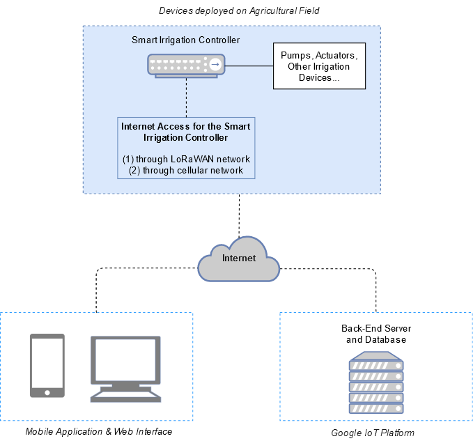

- The *Smart Irrigation System*'s objective is to 'enhance' the irrigation process on agricultural fields. It does so by scheduling optimal irrigation cycles, which aim to reduce water wastage and maximize crop yield.
- It has three main components :
  1. Smart Irrigation Controller
  2. Back-End Server
  3. Mobile Application & Web Interface

### Smart Irrigation Controller

- **Controller** :
  - The Smart Irrigation Controller is based on a Raspberry-Pi 3 Model B board (Raspberry-Pi model is subject to change, although they all share a similar structure, operating system, and interfaces).
- **Operating System** : 
  - It will be fitted with a pre-configured micro-SD card containing *Raspbian* (recently renamed *Raspberry-Pi OS*), and all required packages & software.

- **Custom Add-on PCB** : 
  - To function as intended, the Smart Irrigation Controller requires modules and interfaces not present on the stock Raspberry-Pi. As such, we have designed a PCB which offers support for these requirements, and which can be connected to the Raspberry-Pi through its GPIO interface.
  - These include (1) a LoRa Transceiver, (2) a GSM Module, (3) and additional interfaces so the Raspberry-Pi can physically communicate  with Irrigation Systems.
- **Power System** : 
  - The Smart Irrigation Controller being based on Raspberry-Pi board, it must follow its requirements, and be powered constantly at a recommended 5V@2A. We can power it either through the Raspberry-Pi's micro-USB port, or through specific pins on its GPIO interface. 
  - To ensure that our Smart Irrigation Controller is portable & self-sufficient, it remains connected to a  power system, using solar power to recharge its batteries.

- **Software** :
  - An *Apache* web server will be running constantly on the Raspberry-Pi. This web server will host the web interface, which allows farmers to control irrigation routines & receive information.
  - A *Python* script will be running constantly on the Raspberry-Pi. This script will execute irrigation routines, periodically poll the flow meter for changes, and handle all traffic sent/received through the external wireless modules (i.e. LoRa and GSM modules).

### Back-End Server

- **Cloud-Based** :
  - Back-End Server and Database are hosted on the Google Cloud IoT platform, which allows for automatic scaling & load-balancing, as well as database redundancy.
- **Database** : 
  - Stores all necessary information on users and their agricultural fields.
- **Supports HTTP Requests** : 
  - Offers a RESTful API, which facilitates requests from all devices involved in the Smart Irrigation System
  - Receives data from users to keep track of completed irrigation cycles
  - Sends recommended irrigation routines to users with registered agricultural fields

### Mobile Application & Web Interface

- **Mobile Application** :
  - Android-based mobile application which allows user to directly configure the Irrigation Schedule on their agricultural fields (assuming they have a Smart Irrigation Controller installed), or simply keep track of recommendations concerning their agricultural fields.
- **Web Interface**
  - Web-based Interface which runs directly on the Smart Irrigation Controller, and allows us to configure its on-board modules, set the irrigation schedule, and check Irrigation logs/history.