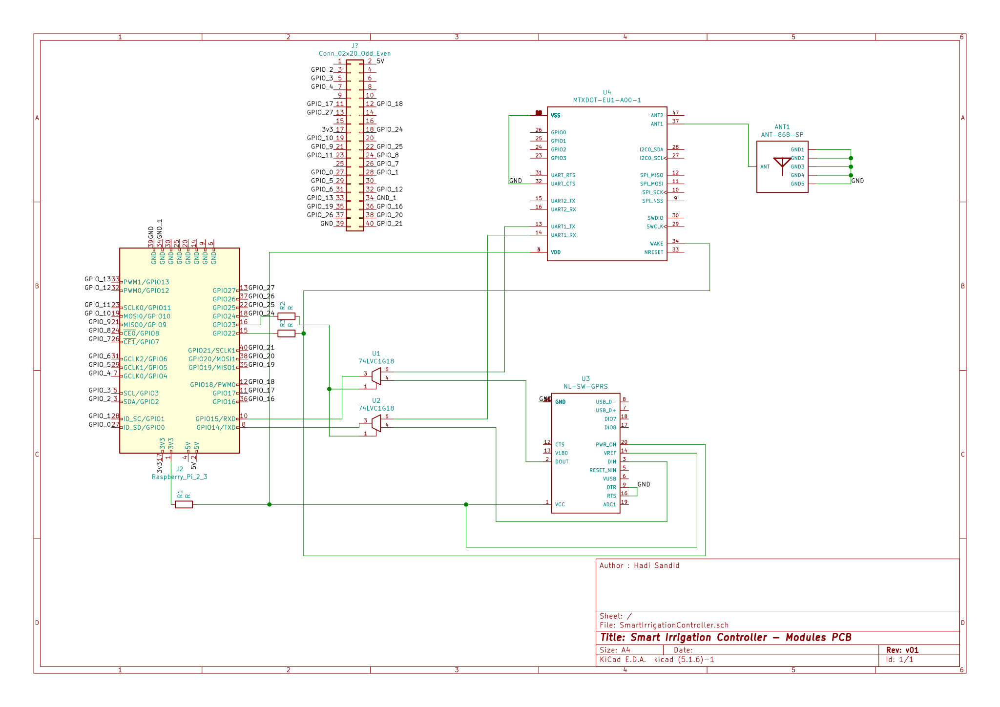

- Complete KiCad project (including schematics, footprints and layouts) is available [here](../../zip/SmartIrrigationController-V1.zip).
- For this implementation, we've used the UART interface of the Raspberry-Pi (GPIO Pins #14 and #15), two additional GPIO Pins to control elements of the circuit ( GPIO Pins #22 and #23 ), a 3v3 output power pin, and a ground pin.
- There are still 24 available GPIO pins, which can be used to control additional modules. The SPI & I2C interfaces are also fully available, if we'd like to use them with other modules.

# Schematic Circuit

# PCB Layout

Front Layer :

Back Layer :

3D View :

